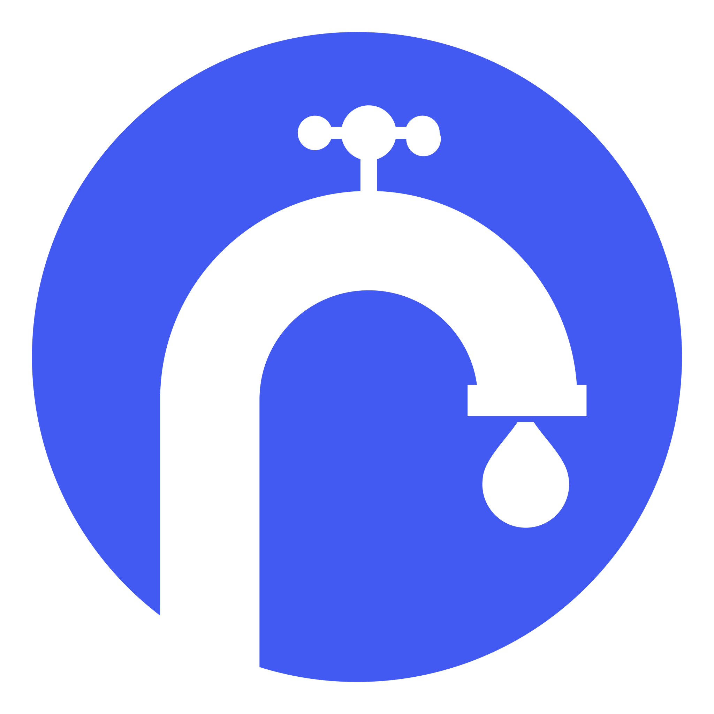

  

# FreeTaps

The app that shows you all water points, to drink everywhere and without any plastic waste!

## Usage

### Commands

- `npm run assets` generates icons and splash screens ([documentation](https://github.com/ionic-team/capacitor-assets))
- `npm run dev` compiles JavaScript and watches for changes
- `npm run build` compiles and minifies JavaScript
- `npm run sync` builds JavaScript and updates the native Android and iOS projects with the changes that have been done in the Web project, it needs to run every time an update is made ([documentation](https://ionicframework.com/docs/cli/commands/capacitor-sync))
- `npm run open:android` opens Android project in Android Studio
- `npm run open:ios` opens iOS project in Xcode
- `npm run simulate:android` launches the app in an Android Studio virtual device ([documentation](https://capacitorjs.com/docs/android))
- `npm run simulate:ios` launches the app in macOS Simulator ([documentation](https://capacitorjs.com/docs/ios))

### Development

Simply open [`src/index.html`](./src/index.html) in your browser and start working!

### Build

#### Android

1. Update version code and version name in [`build.gradle`](./android/app/build.gradle)
2. `npm run open:android`
3. Build tab > Generate Signed Bundle / APK...
4. Android App Bundle
5. Fill key store settings
6. `release`
7. Upload `.aab` file in the Google Play Console

#### iOS

1. Update marketing version in [`project.pbxproj`](./ios/App/App.xcodeproj/project.pbxproj)
2. `npm run open:ios`
3. Product tab > Destination > Any iOS Device (arm64)
4. Product tab > Archive
5. Distribute App

## License

Made with [Ionic Framework](https://ionicframework.com/) and [Capacitor](https://capacitorjs.com/).

Source code provided under the [CC-BY-SA-4.0 license](https://github.com/tseignette/gallery/blob/main/LICENSE).
